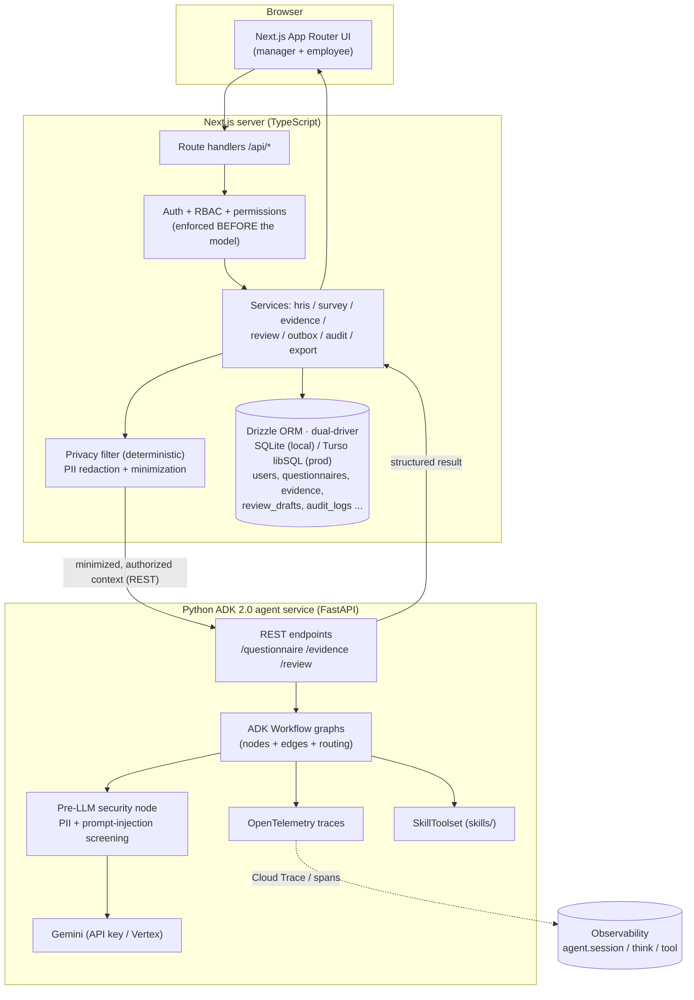
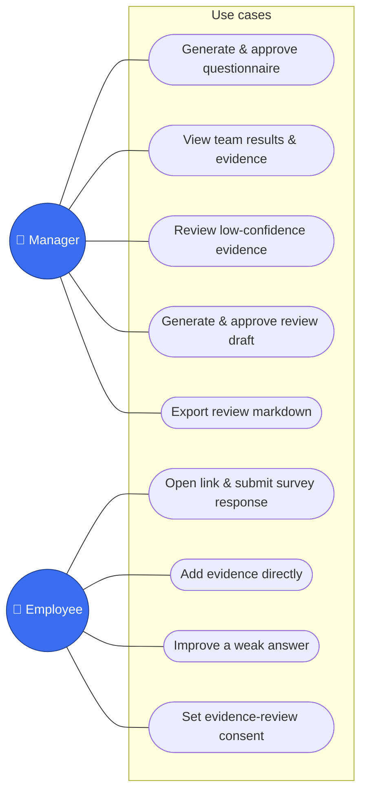
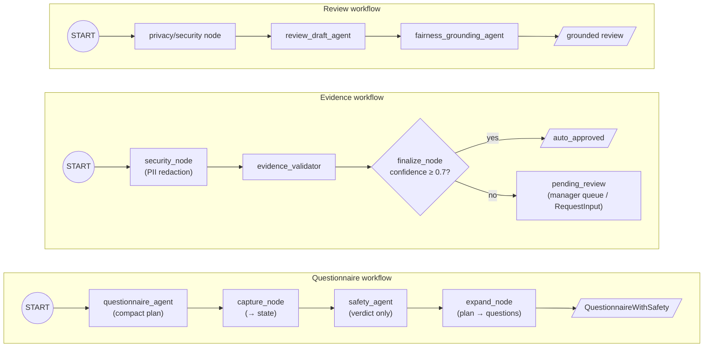
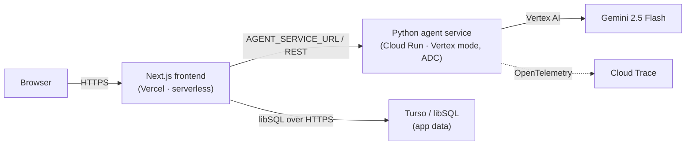

# ReviewOps Agent — Architecture (Hybrid)

> **Authoritative architecture doc.** The agent brain runs in a **Python ADK 2.0
> service**; the Next.js app is the frontend. This consolidates the original
> all-TypeScript design notes (the former `ARCHITECTURE_AND_SECURITY.md`, now
> retired — see §5–9). See "Why hybrid" below.

ReviewOps Agent is a permission-aware, evidence-grounded assistant for
engineering managers. It generates questionnaires, collects employee-approved
evidence, validates evidence quality, and drafts grounded reviews — always with
human approval.

The design deliberately applies two Google 2026 whitepapers:
- **Vibe Coding Agent Security & Evaluation** (7-Pillar security, evaluation
  framework, observability).
- **Agent Skills** (SKILL.md + progressive disclosure, `SkillToolset`, skill
  evaluation).

---

## 1. System architecture



**Boundary rule (unchanged from the original design):** access control and
consent are enforced in the TypeScript app **before** any data reaches the agent
service. The service only ever receives already-authorized, minimized,
PII-redacted context. The LLM is never the authorization boundary.

### Why hybrid (TS frontend + Python agent service)
Google's current ADK best-practice stack — graph `Workflow`, `RequestInput`
HITL, `agents-cli` lifecycle (scaffold / playground / eval / deploy to Agent
Runtime) — ships in **Python ADK 2.0**. The TypeScript line (`@google/adk` 1.3)
is capable (`RoutedAgent`, `LongRunningFunctionTool`) but lacks the graph DSL and
Agent Runtime target. To maximize ADK depth while keeping the TS UI, the agent
brain is Python; the app stays TypeScript and calls it over REST.

### 1.1 Usage — actors & use cases



### 1.2 Activity — end-to-end lifecycle


The standalone **Add evidence directly** path (U7) reuses the same
security→validate→confidence-route activity (G→H→I) without a questionnaire.

---

## 2. Agent workflows (ADK 2.0 graphs)

Each agent is an ADK `Agent` with a Pydantic `input_schema`/`output_schema`;
agents are composed into graph `Workflow`s. Deterministic logic (security,
routing) lives in `@node` functions — "write software, not rules."



| Workflow | Nodes | Status |
| --- | --- | --- |
| Questionnaire | `questionnaire_agent → capture_node → safety_agent → expand_node` | ✅ live via REST; dynamic structure + scale legend |
| Evidence | `security_node → evidence_validator → finalize_node` (confidence routing) | ✅ live via REST; confidence-gated routing |
| Review | `privacy_node → review_draft_agent → fairness_node` | ✅ live via REST; grounded + fairness report |

All three run live against Gemini (`gemini-2.5-flash`) via the local REST server
(`app/local_server.py`) and are wired into the TS app over `AGENT_SERVICE_URL`.

**Compact plan + deterministic expansion (scaling).** `questionnaire_agent` emits
a **compact `QuestionnairePlan`** — each item listed ONCE, the rating scale listed
once, with a per-item `uses_scale` flag — not fully-expanded questions. It's
threaded through `capture_node`'s state; `safety_agent` reviews the plan and
returns only a `SafetyReport` (verdict); then the deterministic `expand_node`
builds the full `QuestionnaireOutput` in code — stamping the shared scale options
onto matrix items, Yes/No opt-in gates, sections, and positions — and pairs it
with the verdict into the terminal `QuestionnaireWithSafety`. Because the model's
output stays small and bounded regardless of item count, a big skill matrix no
longer truncates or blows the latency budget (previously the model emitted every
question with repeated options → a ~5.7k-line JSON that exceeded the token limit
and 500'd). `questionnaire_agent` also keeps `max_output_tokens` (32k) + a single
attempt; if a plan still overflows, `local_server` returns a clean **422** ("too
large — split it"), never an opaque 500; the TS `agentClient` adds a 120s timeout
and the agent-backed Next routes set `maxDuration`. A ~120-item matrix generates
in ~30s. (Matrix-ness is per-item, so mixed questionnaires — some scale items,
some free-text — work.)

**Chunked generation (very large pasted matrices).** A big matrix in one LLM call
is O(N) output → slow and can hit Vercel's 60s function cap. For a large sectioned
paste, `/questionnaire` (`local_server.build_chunks` / `generate_chunked`) splits
the notes into chunks of **whole sections** — each chunk carries the shared
preamble + scale — runs plan generation per chunk **in parallel**
(`asyncio.gather` + a concurrency cap) via `plan_workflow`, **merges** the plans,
runs `safety_workflow` once, and expands. Because the chunks run concurrently, the
total ≈ the slowest chunk + safety, so a ~400-item / 20-section matrix generates in
~40s (vs a 60s `FUNCTION_INVOCATION_TIMEOUT` in a single pass) with **sections +
per-section opt-in gates + the shared scale preserved**. Typical questionnaires
(small notes) take the normal single-pass workflow. (Async + poll for even larger
non-matrix bulk remains roadmap.)

### 2.1 Dynamic questionnaires (manager-driven)

The questionnaire generator reproduces whatever structure the manager describes
rather than emitting a fixed survey:
- **Per-item questions** — a list of skills/competencies becomes one question
  each (no summarizing); a given rating scale (e.g. L1–L5) becomes a
  `single_choice` with the levels as `options`.
- **Sections + opt-in gates** — named groups render together; an "answer yes to
  reveal" rule becomes a `single_choice` Yes/No gate (`opt_in`) that conditionally
  shows its section.
- **Scale legend** — when many questions share a rating scale, the full level
  descriptions are emitted **once** in `scale_legend` (`{label, description}`);
  each question's `options` carry only short labels, rendered with one collapsible
  legend (manager preview + employee survey).
- **Question types** — `short_text`, `long_text`, `single_choice`, `multi_choice`,
  `rating`, `number`, `date`, `email`, `evidence_link`, `attachment`.
- **Per-question evidence** — the manager's "require evidence" toggle gates
  `evidence_required`, set only on free-text questions (never on choice/typed
  fields); no standalone "paste a link" questions.
- **Deterministic normalizer** — `src/server/agents/normalizeQuestions.ts`
  enforces these invariants on the (untrusted) model output *before* persistence:
  strip evidence from non-text fields, drop empty choices (degrade to text),
  clear stray gates, coerce unknown types.
- **Refine & regenerate** — a manager can give free-text feedback on a *draft*
  and re-run the agent in place (`orchestrateQuestionnaireRegeneration`); the
  original request is stored (`gen_input_json`) and feedback accumulates.
- **Hard-refuse on prohibited requests** — if a request is *dominated* by
  protected topics (health, family, religion, politics, …), the agent refuses
  (`refused: true`, no questions) and the safety verdict is `needs_revision` with
  the reason — it is **not** silently substituted and reported "approved."
  (Surfaced by `agents-cli eval`; see EVALUATION_PLAN §2.4.)

### 2.1a Ambient — deadlines & reminders

A questionnaire can carry a `deadline`. The manager dashboard shows per-questionnaire
completion (submitted/total) and flags **overdue** ones; **"Send reminders"**
(`remindersService.sendReminders`) writes nudge rows to the mock outbox
(`channel:"reminder"`) for outstanding respondents, de-duped within a window. This
is the seam a real Slack/email delivery or a **Cloud Scheduler → `/api/cron/reminders`**
job would drive for fully event-driven nudges.

### 2.2 Evidence submission (confirm-before-store + improve-loop)

On standalone evidence submit, the validator scores it and:
- **strong** → stored `auto_approved`; **weak** → the employee gets the follow-up
  and must **improve or explicitly "submit anyway for manager review"**
  (weak evidence is not silently stored);
- **dedup + lock** — while unreviewed, a resubmit *updates the same item* (no
  duplicates); once a manager approves/rejects it is locked and a new submission
  is a new item;
- the **raw text** (`source_text`) and the validator's **concern** are stored for
  manager transparency.

### Main request flow (review generation)

```mermaid
sequenceDiagram
  participant M as Manager (UI)
  participant API as Next API
  participant Perm as Permissions
  participant RS as reviewService
  participant AS as Agent service (Python)
  participant G as Gemini

  M->>API: POST /api/reviews/generate {employeeId, period}
  API->>Perm: assertManagerCanViewEmployee()
  Perm-->>API: ok (else 403)
  API->>RS: generateReviewContext() — consent-gated evidence only
  RS->>RS: privacy filter (minimize + redact)
  RS->>AS: POST /review {sanitized context}
  AS->>AS: pre-LLM security node
  AS->>G: review_draft_agent → fairness_grounding_agent
  G-->>AS: grounded draft + fairness report
  AS-->>RS: structured result
  RS->>RS: save draft (status=draft); audit
  RS-->>M: draft + fairness warnings (manager approves/edits/exports)
```

---

## 3. Tools & services

| Layer | TypeScript app | Python agent service |
| --- | --- | --- |
| Tools | hris / survey / evidence / review / **privacy** / **connectors** facades | ADK `FunctionTool`s; `SkillToolset` for skills |
| Services own permission checks | yes (before model) | n/a (receives authorized context) |
| State | SQLite (Drizzle), local files (`data/exports`) | ADK session/state (graph), stateless REST |

### 3.1 External HR connectors (BambooHR / Lattice boundary)

`src/server/connectors/` defines vendor-neutral **data contracts** that mirror
real provider APIs — a BambooHR-shaped `DirectoryConnector` (employees/org graph)
and a Lattice-shaped `PerformanceConnector` (peer reviews, feedback, 1:1 notes,
goals). A **mock provider** implements them today; a live API or **MCP server**
can swap in behind the same async interface — callers depend only on the contract.

`gatherReviewSignals(managerId, employeeId, cycle)` adapts peer reviews / feedback
/ 1:1 notes into evidence-shaped, **citeable** grounding signals for the review
draft (ids like `peer:…`, `fb:…`, `1on1:…`).

> **Privacy posture (important):** connector signals are **fetched transiently**
> at review-generation time and **never stored** in ReviewOps — only the final
> review draft is saved. They pass the same **deterministic PII filter** as
> internal evidence, and peer reviews are **reviewer-anonymized** (only the
> comment is passed, never the reviewer's identity). The employee
> `allow_for_review` consent gate governs **self-submitted** evidence; manager/
> HR-owned records (1:1 notes, collected peer reviews) are not employee-gated, by
> design — the manager already legitimately has them.

### 3.2 Data layer & deployment

The frontend's DB is **dual-driver** (`src/server/db/index.ts`): **better-sqlite3**
(synchronous, file-based) for local dev + tests, and **Turso / libSQL** (async,
hosted) when `TURSO_DATABASE_URL` is set (serverless / Vercel). The whole data
layer is `async`, so the same code drives both drivers.

Deployment (see `docs/DEPLOY.md`): the **stateless Python agent service → Cloud
Run** (serving the REST contract, in Vertex mode with no API key — the runtime
service account authenticates via ADC); the **Next.js frontend → Vercel** with the
Turso DB. **Live and verified end-to-end** at
**https://reviewops-agent.vercel.app** (a Playwright smoke, `npm run e2e`, drives
login → permission scope → live questionnaire generation against this URL).



Only the **Next.js server** (not the browser) calls Cloud Run, so no CORS/public
agent exposure is needed; secrets live in Vercel env vars + the Cloud Run runtime
SA, never in the image or the repo.

---

## 4. Frameworks applied

### 4.1 Security — 7-Pillar mapping (FILE1)

| Pillar | ReviewOps today | Roadmap |
| --- | --- | --- |
| 1 Infra & networking | local dev; Cloud Run/Agent Runtime later | gVisor sandbox, egress governance |
| 2 Data | SQLite, consent gate, **PII redaction before model** | CMEK/mTLS, tenant partitioning |
| 3 Model | prompts as versioned constants; structured schemas | signed/attested prompt artifacts |
| 4 App & runtime | **no secrets in frontend**, RBAC, deterministic privacy filter, safety agent, **agent shared-secret + per-manager rate limit** | LLM firewall, lifecycle hooks, MCP contextual auth |
| 5 IAM | **signed (HMAC) sessions** + passphrase manager login; demo/real split via `isTestUser`; access checks before model | OAuth / email-allowlist + magic link, agentic identity (SPIFFE), JIT downscoping |
| 6 Observability & SecOps | audit log | **OpenTelemetry traces** (ADK built-in), ABA, red/blue/green |
| 7 Governance | audit trail; **HITL approval = "Vibe Diff" logic review** | EU AI Act impact assessment, attestation |

Notably already aligned: **access control before the model**, **pre-LLM PII
redaction**, **human-in-the-loop approval** (the whitepaper's "Vibe Diff" — show
the human plain-language intent→action before consent), and **no
prompt-based security**.

### 4.1a Authentication & abuse protection (real-use hardening)
The demo keeps one-click login for synthetic (`isTestUser`) users, but real use
adds three layers:
- **Tamper-proof sessions.** The session cookie is `uid|HMAC-SHA256(uid,
  SESSION_SECRET)` (`auth/mockSession.ts`); a forged/plaintext cookie fails
  verification, so a client can't mint a manager session. RBAC only *scopes* an
  identity — signing is what makes the identity trustworthy.
- **Demo vs real split.** `isTestUser` gates the login switcher and the
  passwordless `/api/login`; real accounts (flag false) are hidden and reachable
  only via `POST /api/login/passphrase` (constant-time compare of
  `MANAGER_PASSPHRASE`, throttled). OAuth / magic-link is the roadmap upgrade.
- **Agent abuse / quota.** The public Cloud Run agent requires a shared
  `X-Agent-Key` (only our backend has it) → strangers get 401 before any Gemini
  call; expensive endpoints are additionally rate-limited per manager. (CORS is
  deliberately *not* relied on — it's browser-only and useless against direct
  HTTP clients.)

### 4.2 Evaluation (FILE1 dimensions × methods)

Relevant dimensions for ReviewOps (structured-output agents, not code-gen):
**intent satisfaction** (does the questionnaire/review match the request),
**functional correctness** (schema validity, evidence citations present),
**trajectory quality** (right nodes/tools in order), **safety/responsible-AI**
(safety agent + privacy filter), **cost/efficiency** (tokens/latency per flow).

Methods: `agents-cli eval` (golden datasets + **LLM-as-judge** with
position-swap + human calibration), **trajectory inspection** via OpenTelemetry,
TS Vitest for permissions/tokens/results. Apply the **Read → Draft → Act**
graduation and `pass^k` for action-allowed flows (e.g. auto-approving evidence).

Golden datasets exist for **all three workflows** under
`agent-service/tests/eval/datasets/` (`reviewops-questionnaire.json`,
`reviewops-evidence.json`, `reviewops-review.json`) with matching rubrics in
`eval_config.yaml` (`questionnaire_quality`, `evidence_quality`, `review_quality`,
+ an `agent_turn_count` trajectory metric). Authoring is done; **running
`agents-cli eval generate/grade` needs GCP** (Vertex AI Eval Service + GCS ADC).
A no-GCP `tests/eval/structural_smoke.py` covers deterministic structural checks
against the live REST service in the meantime.

### 4.3 Observability (FILE1)

ADK 2.0 + Agent Engine emit OpenTelemetry spans (`agent.session`, `agent.think`,
`agent.tool`) → **Cloud Trace**. The scaffolded service already wires
`setup_telemetry()`. We trace the per-request "trajectory", measure token cost,
and use tail-based sampling (keep error/high-correction traces).

### 4.4 Skills (FILE2)

Agents load **Skills** (folder + `SKILL.md` + scripts/references/assets,
progressive disclosure) via ADK **`SkillToolset`**. Candidate ReviewOps skills:
`drafting-performance-reviews`, `validating-evidence`,
`generating-evidence-surveys`, `fairness-grounding-check`. Each follows
**EDD** (3 JSON eval cases before the SKILL.md), a sharp `description` (trigger +
when-NOT), and the eval-coverage checklist (trigger / execution / regression /
token-budget). Skills compose with MCP (know-how vs reach), and deterministic
work lives in `scripts/`, not prose rules.

---

## 5. Data model (SQLite / Drizzle)

Source of truth: `src/server/db/schema.ts`. Tables:

| Table | Key fields | Notes |
| --- | --- | --- |
| `users` | email, display_name, role_title, **manager_id**, is_hr_admin | mock HRIS is the source of truth for identity/manager/role |
| `goals` | employee_id, title, period, status | official goals per period |
| `questionnaires` | created_by_manager_id, period, **deadline**, **privacy_mode**, **evidence_validation**, safety_json, **scale_legend_json**, **gen_input_json**, status | statuses: draft→approved→sent→closed→archived; privacy modes: `named_review_evidence` (MVP), `anonymous_team_pulse`, `confidential_hr_only`. `scale_legend_json` = shared rating scale; `gen_input_json` = original request (for regenerate) |
| `questions` | questionnaire_id, position, question_type, **options_json**, required, **evidence_required**, **section**, **opt_in**, explanation | types: short_text, long_text, single_choice, multi_choice, rating, **number, date, email**, evidence_link, attachment. `section` + `opt_in` drive grouped/conditional rendering |
| `survey_assignments` | questionnaire_id, respondent_id, **token_hash**, expires_at, status | statuses: pending, opened, submitted, expired, revoked |
| `responses` | assignment_id, question_id, answer_text, **visibility** | visibility: private_draft, share_with_manager, **allow_for_review**, anonymous_aggregate |
| `evidence_items` | employee_id, source_type, **source_text**, summary, impact, **concern**, period, company_value, goal_id, quality_score, **confidence**, visibility, **status** | `status`: draft/pending_review/approved/rejected/auto_approved (confidence-gated routing). `source_text` = raw employee words; `concern` = validator's note (manager transparency) |
| `attachments` | evidence_id, file_path, pii_scan_status | metadata-only / local upload in MVP |
| `review_drafts` | employee_id, manager_id, period, draft_markdown, grounding_report_json, fairness_report_json, status | statuses: draft, needs_revision, approved, exported |
| `outbox` | questionnaire_id, respondent_id, assignment_id, link | mock delivery (stands in for Slack/email) |
| `audit_logs` | actor_id, action, resource_type, resource_id, metadata_json | sensitive actions incl. denied access |

## 6. Access control & token design

Enforced in TypeScript **before** any data reaches the agent service
(`src/server/auth/`). Never rely on an LLM prompt for security.

- **Manager scope:** `canManagerViewEmployee(managerId, employee) = employee.manager_id === managerId`. Outside-team access → `403`; unauthenticated → `401`.
- **Employee scope:** an employee can access only their own assignment/evidence.
- **Token scope (`src/server/utils/crypto.ts`):** survey links use `crypto` random tokens; only the **SHA-256 hash** is stored on the assignment. A token maps to exactly one assignment, has an expiry + revoked state, and cannot reach manager results. **Respondent identity is derived from the token**, never from request input.
- **Consent gate:** evidence inherits the response's `visibility`; only `allow_for_review` evidence can ground a review draft (`getEvidenceForReview`).

## 7. Personal data handling & privacy pipeline

The mock HRIS is the source of truth for identity/manager/role/goals; ReviewOps
stores only questionnaires, responses, evidence, attachments, scores, review
drafts, approval state, and audit logs. Before anything reaches the model:

```
raw data → permission filter → data minimization → PII redaction
         → evidence-card normalization → model call
```

The privacy filter is **deterministic** (a security control, never the model)
and logs the *categories* removed, not the values. In the hybrid, the TS app
runs the filter before the REST call; the Python service also has a pre-LLM
security node (PII + prompt-injection screening) as defense-in-depth.

## 8. Human-in-the-loop

Approval is required before: sending questionnaires, closing them, generating
final review drafts, approving drafts, and exporting. This is the whitepaper's
**"Vibe Diff"** logic review — show the human plain-language intent→action before
consent. The standalone evidence flow adds a manager **approve/reject** gate for
low-confidence evidence.

## 9. Testing & verification

- **TS Vitest** (`tests/`, **50 tests**): permissions/scope; token hash stored
  (not raw); expired token denied; cross-assignment isolation; questionnaire
  schema valid; sensitive question rejected; vague answer → follow-up; review
  cites evidence; unsupported claim flagged; consent gate; **normalizer
  invariants**; **survey-form logic** + **RTL component tests** (jsdom);
  **evidence confirm-before-store / dedup / lock**; **connector** contracts +
  `gatherReviewSignals`; connector-grounded review context.
- **Python agent service:** `agents-cli eval` golden datasets + LLM-as-judge +
  trajectory inspection (see §4.2); `tests/eval/structural_smoke.py` for
  no-GCP structural checks; `agents-cli playground` / REST for manual validation.

## 10. References
- Google (May 2026), *Vibe Coding Agent Security and Evaluation*.
- Google (May 2026), *Agent Skills*.
- ADK docs: https://adk.dev · agents-cli: https://google.github.io/agents-cli/
- Full original design notes (now merged here): see git history of
  `docs/ARCHITECTURE_AND_SECURITY.md` (retired).
