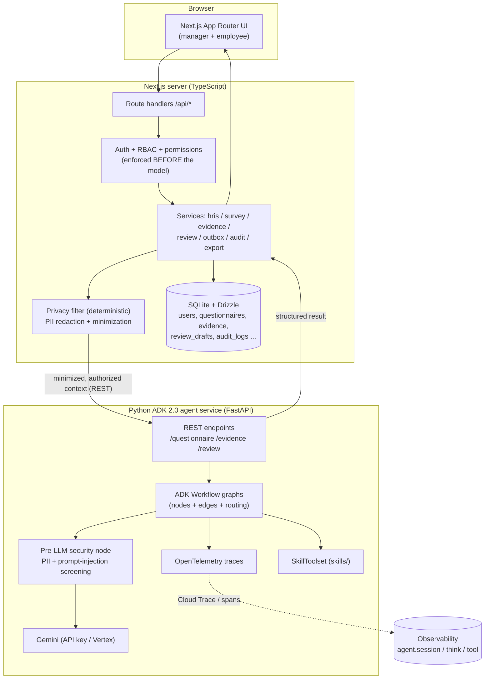
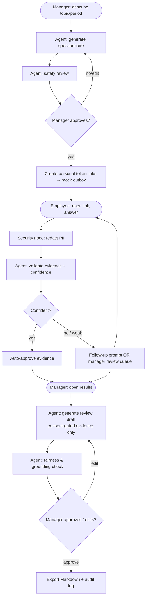
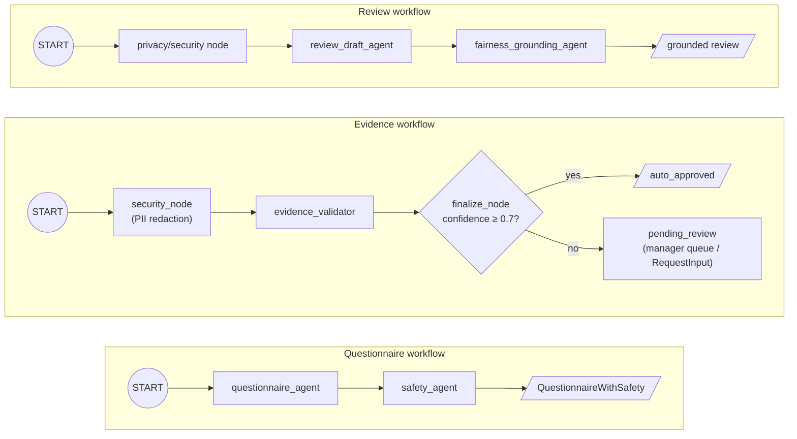

# ReviewOps Agent — Architecture (Hybrid)

> **Authoritative architecture doc.** The agent brain runs in a **Python ADK 2.0
> service**; the Next.js app is the frontend. This consolidates the original
> all-TypeScript design notes (the former `ARCHITECTURE_AND_SECURITY.md`, now
> retired — see §5–9). See "Why hybrid" below.

ReviewOps Agent is a permission-aware, evidence-grounded assistant for
engineering managers. It generates questionnaires, collects employee-approved
evidence, validates evidence quality, and drafts grounded reviews — always with
human approval.

The design deliberately applies two Google 2026 whitepapers:
- **Vibe Coding Agent Security & Evaluation** (7-Pillar security, evaluation
  framework, observability).
- **Agent Skills** (SKILL.md + progressive disclosure, `SkillToolset`, skill
  evaluation).

---

## 1. System architecture



**Boundary rule (unchanged from the original design):** access control and
consent are enforced in the TypeScript app **before** any data reaches the agent
service. The service only ever receives already-authorized, minimized,
PII-redacted context. The LLM is never the authorization boundary.

### Why hybrid (TS frontend + Python agent service)
Google's current ADK best-practice stack — graph `Workflow`, `RequestInput`
HITL, `agents-cli` lifecycle (scaffold / playground / eval / deploy to Agent
Runtime) — ships in **Python ADK 2.0**. The TypeScript line (`@google/adk` 1.3)
is capable (`RoutedAgent`, `LongRunningFunctionTool`) but lacks the graph DSL and
Agent Runtime target. To maximize ADK depth while keeping the TS UI, the agent
brain is Python; the app stays TypeScript and calls it over REST.

### 1.1 Usage — actors & use cases


### 1.2 Activity — end-to-end lifecycle



The standalone **Add evidence directly** path (U7) reuses the same
security→validate→confidence-route activity (G→H→I) without a questionnaire.

---

## 2. Agent workflows (ADK 2.0 graphs)

Each agent is an ADK `Agent` with a Pydantic `input_schema`/`output_schema`;
agents are composed into graph `Workflow`s. Deterministic logic (security,
routing) lives in `@node` functions — "write software, not rules."



| Workflow | Nodes | Status |
| --- | --- | --- |
| Questionnaire | `questionnaire_agent → safety_agent` | ✅ working, validated vs Gemini |
| Evidence | `security_node → evidence_validator → finalize_node` (confidence routing) | 🟡 WIP (REST validation pending) |
| Review | `privacy_node → review_draft_agent → fairness_grounding_agent` | ⬜ to build |

### Main request flow (review generation)

```mermaid
sequenceDiagram
  participant M as Manager (UI)
  participant API as Next API
  participant Perm as Permissions
  participant RS as reviewService
  participant AS as Agent service (Python)
  participant G as Gemini

  M->>API: POST /api/reviews/generate {employeeId, period}
  API->>Perm: assertManagerCanViewEmployee()
  Perm-->>API: ok (else 403)
  API->>RS: generateReviewContext() — consent-gated evidence only
  RS->>RS: privacy filter (minimize + redact)
  RS->>AS: POST /review {sanitized context}
  AS->>AS: pre-LLM security node
  AS->>G: review_draft_agent → fairness_grounding_agent
  G-->>AS: grounded draft + fairness report
  AS-->>RS: structured result
  RS->>RS: save draft (status=draft); audit
  RS-->>M: draft + fairness warnings (manager approves/edits/exports)
```

---

## 3. Tools & services

| Layer | TypeScript app | Python agent service |
| --- | --- | --- |
| Tools | hris / survey / evidence / review / **privacy** facades | ADK `FunctionTool`s; `SkillToolset` for skills |
| Services own permission checks | yes (before model) | n/a (receives authorized context) |
| State | SQLite (Drizzle), local files (`data/exports`) | ADK session/state (graph), stateless REST |

---

## 4. Frameworks applied

### 4.1 Security — 7-Pillar mapping (FILE1)

| Pillar | ReviewOps today | Roadmap |
| --- | --- | --- |
| 1 Infra & networking | local dev; Cloud Run/Agent Runtime later | gVisor sandbox, egress governance |
| 2 Data | SQLite, consent gate, **PII redaction before model** | CMEK/mTLS, tenant partitioning |
| 3 Model | prompts as versioned constants; structured schemas | signed/attested prompt artifacts |
| 4 App & runtime | **no secrets in frontend**, RBAC, deterministic privacy filter, safety agent | LLM firewall, lifecycle hooks, MCP contextual auth |
| 5 IAM | mock session now; access checks before model | agentic identity (SPIFFE), JIT downscoping |
| 6 Observability & SecOps | audit log | **OpenTelemetry traces** (ADK built-in), ABA, red/blue/green |
| 7 Governance | audit trail; **HITL approval = "Vibe Diff" logic review** | EU AI Act impact assessment, attestation |

Notably already aligned: **access control before the model**, **pre-LLM PII
redaction**, **human-in-the-loop approval** (the whitepaper's "Vibe Diff" — show
the human plain-language intent→action before consent), and **no
prompt-based security**.

### 4.2 Evaluation (FILE1 dimensions × methods)

Relevant dimensions for ReviewOps (structured-output agents, not code-gen):
**intent satisfaction** (does the questionnaire/review match the request),
**functional correctness** (schema validity, evidence citations present),
**trajectory quality** (right nodes/tools in order), **safety/responsible-AI**
(safety agent + privacy filter), **cost/efficiency** (tokens/latency per flow).

Methods: `agents-cli eval` (golden datasets + **LLM-as-judge** with
position-swap + human calibration), **trajectory inspection** via OpenTelemetry,
TS Vitest for permissions/tokens/results. Apply the **Read → Draft → Act**
graduation and `pass^k` for action-allowed flows (e.g. auto-approving evidence).

### 4.3 Observability (FILE1)

ADK 2.0 + Agent Engine emit OpenTelemetry spans (`agent.session`, `agent.think`,
`agent.tool`) → **Cloud Trace**. The scaffolded service already wires
`setup_telemetry()`. We trace the per-request "trajectory", measure token cost,
and use tail-based sampling (keep error/high-correction traces).

### 4.4 Skills (FILE2)

Agents load **Skills** (folder + `SKILL.md` + scripts/references/assets,
progressive disclosure) via ADK **`SkillToolset`**. Candidate ReviewOps skills:
`drafting-performance-reviews`, `validating-evidence`,
`generating-evidence-surveys`, `fairness-grounding-check`. Each follows
**EDD** (3 JSON eval cases before the SKILL.md), a sharp `description` (trigger +
when-NOT), and the eval-coverage checklist (trigger / execution / regression /
token-budget). Skills compose with MCP (know-how vs reach), and deterministic
work lives in `scripts/`, not prose rules.

---

## 5. Data model (SQLite / Drizzle)

Source of truth: `src/server/db/schema.ts`. Tables:

| Table | Key fields | Notes |
| --- | --- | --- |
| `users` | email, display_name, role_title, **manager_id**, is_hr_admin | mock HRIS is the source of truth for identity/manager/role |
| `goals` | employee_id, title, period, status | official goals per period |
| `questionnaires` | created_by_manager_id, period, **privacy_mode**, status | statuses: draft→approved→sent→closed→archived; privacy modes: `named_review_evidence` (MVP), `anonymous_team_pulse`, `confidential_hr_only` |
| `questions` | questionnaire_id, position, question_type, required, explanation | types: short_text, long_text, single_choice, multi_choice, rating, evidence_link, attachment |
| `survey_assignments` | questionnaire_id, respondent_id, **token_hash**, expires_at, status | statuses: pending, opened, submitted, expired, revoked |
| `responses` | assignment_id, question_id, answer_text, **visibility** | visibility: private_draft, share_with_manager, **allow_for_review**, anonymous_aggregate |
| `evidence_items` | employee_id, source_type, summary, impact, period, company_value, goal_id, quality_score, **confidence**, visibility | **planned: add `status`** (draft/pending_review/approved/rejected/auto_approved) for the standalone evidence flow + confidence-gated routing |
| `attachments` | evidence_id, file_path, pii_scan_status | metadata-only / local upload in MVP |
| `review_drafts` | employee_id, manager_id, period, draft_markdown, grounding_report_json, fairness_report_json, status | statuses: draft, needs_revision, approved, exported |
| `outbox` | questionnaire_id, respondent_id, assignment_id, link | mock delivery (stands in for Slack/email) |
| `audit_logs` | actor_id, action, resource_type, resource_id, metadata_json | sensitive actions incl. denied access |

## 6. Access control & token design

Enforced in TypeScript **before** any data reaches the agent service
(`src/server/auth/`). Never rely on an LLM prompt for security.

- **Manager scope:** `canManagerViewEmployee(managerId, employee) = employee.manager_id === managerId`. Outside-team access → `403`; unauthenticated → `401`.
- **Employee scope:** an employee can access only their own assignment/evidence.
- **Token scope (`src/server/utils/crypto.ts`):** survey links use `crypto` random tokens; only the **SHA-256 hash** is stored on the assignment. A token maps to exactly one assignment, has an expiry + revoked state, and cannot reach manager results. **Respondent identity is derived from the token**, never from request input.
- **Consent gate:** evidence inherits the response's `visibility`; only `allow_for_review` evidence can ground a review draft (`getEvidenceForReview`).

## 7. Personal data handling & privacy pipeline

The mock HRIS is the source of truth for identity/manager/role/goals; ReviewOps
stores only questionnaires, responses, evidence, attachments, scores, review
drafts, approval state, and audit logs. Before anything reaches the model:

```
raw data → permission filter → data minimization → PII redaction
         → evidence-card normalization → model call
```

The privacy filter is **deterministic** (a security control, never the model)
and logs the *categories* removed, not the values. In the hybrid, the TS app
runs the filter before the REST call; the Python service also has a pre-LLM
security node (PII + prompt-injection screening) as defense-in-depth.

## 8. Human-in-the-loop

Approval is required before: sending questionnaires, closing them, generating
final review drafts, approving drafts, and exporting. This is the whitepaper's
**"Vibe Diff"** logic review — show the human plain-language intent→action before
consent. The standalone evidence flow adds a manager **approve/reject** gate for
low-confidence evidence.

## 9. Testing & verification

- **TS Vitest** (`tests/`): manager cannot view outside-team employee; token
  hash stored (not raw); expired token denied; cross-assignment isolation;
  questionnaire schema valid; sensitive question rejected; vague answer →
  follow-up; review cites evidence; unsupported claim flagged; consent gate.
- **Python agent service:** `agents-cli eval` golden datasets + LLM-as-judge +
  trajectory inspection (see §4.2). `agents-cli playground` / REST for manual
  validation.

## 10. References
- Google (May 2026), *Vibe Coding Agent Security and Evaluation*.
- Google (May 2026), *Agent Skills*.
- ADK docs: https://adk.dev · agents-cli: https://google.github.io/agents-cli/
- Full original design notes (now merged here): see git history of
  `docs/ARCHITECTURE_AND_SECURITY.md` (retired).
