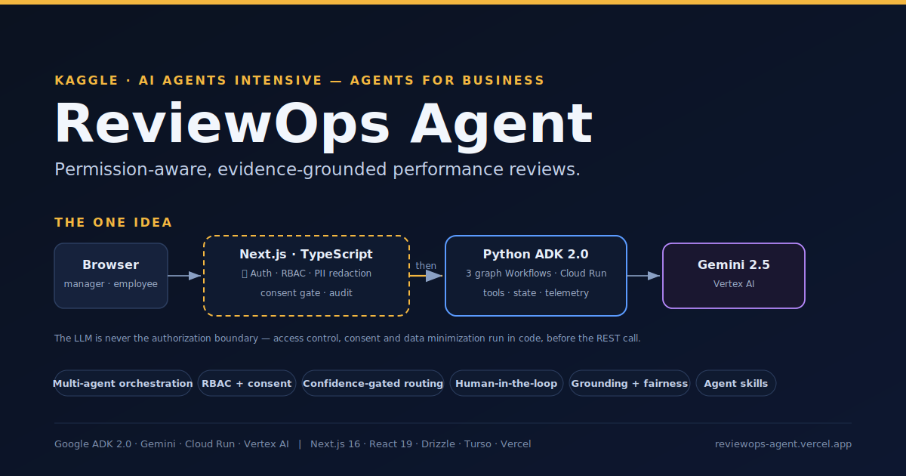
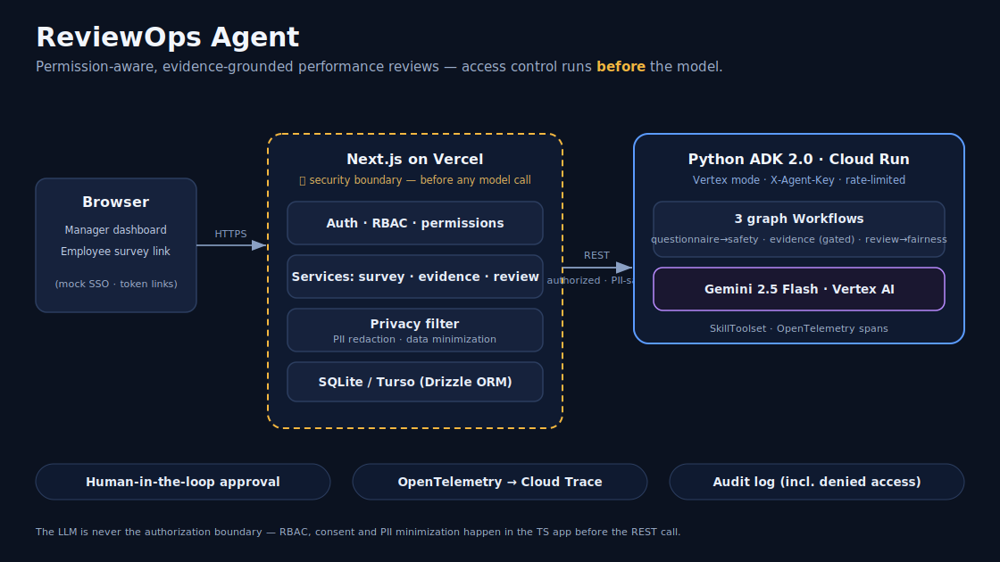
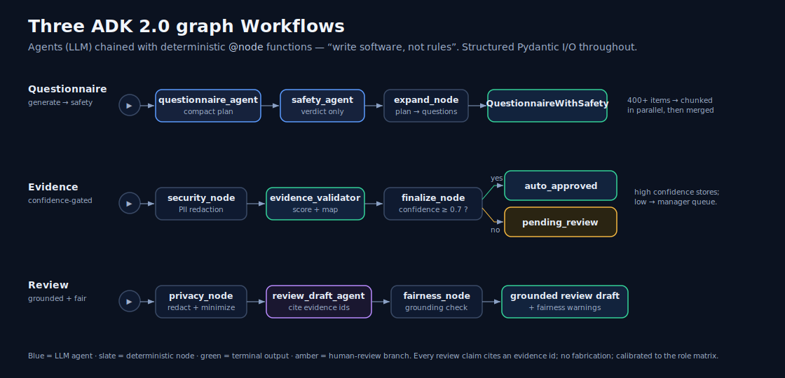

# ReviewOps Agent

**A permission-aware, evidence-grounded review assistant for engineering managers.**

*Kaggle AI Agents Intensive — Capstone · Track: Agents for Business*

**Live demo:** https://reviewops-agent.vercel.app · **Code:** github.com/mkiselyow/ReviewOps-Agent

*(All data is synthetic.)*

---

## The problem

Engineering managers prepare performance reviews from incomplete memory and
scattered evidence. Early-year work is forgotten, recent events are over-weighted,
feedback turns vague, and — increasingly — sensitive HR data gets pasted straight
into an LLM prompt. The result is reviews that are unfair, unsupported, slow to
write, and a privacy liability.

ReviewOps Agent gives employees a structured place to submit their own success
evidence, validates that evidence, and grounds every review claim in
employee-approved evidence — **without making any HR decision automatically, and
without ever sending raw HR data to the model.**

## The one idea

Most "AI for HR" demos put the LLM in the middle and hope it behaves. ReviewOps
inverts that: **access control, consent, and PII minimization run in the
TypeScript application _before_ the agent is ever called.** The LLM is never the
authorization boundary. A manager can only ever see their own direct reports;
only evidence an employee explicitly marked shareable can ground a draft; and the
context that reaches Gemini is already filtered, minimized, and redacted.

That single decision — *earn the trust in code, then use the model* — shapes the
whole architecture.

## What it does

1. A manager logs in; the app loads their direct reports from a mock HRIS
   connector (permissions enforced in code).
2. The manager describes a topic, or pastes a skill matrix + rating scale; the
   **Questionnaire workflow** generates a targeted survey and safety-checks it.
3. On approval, personal token links are minted for each report (mock outbox).
4. Employees open their link and submit evidence. The **Evidence workflow**
   scores quality, asks a follow-up when an answer is vague, and routes
   low-confidence items to the manager's review queue.
5. Strong, consented evidence becomes structured evidence cards mapped to values,
   goals, and role expectations.
6. The manager generates a review draft for one report. The **Review workflow**
   drafts only from consented evidence, cites evidence ids, and runs a fairness /
   grounding check that flags unsupported claims, vague praise, and recency bias.
7. The manager approves and exports the Markdown review.

## Architecture

ReviewOps is a **hybrid**: a TypeScript **Next.js** frontend and a **Python
ADK 2.0** agent service, talking over REST.

- **Next.js app (the security boundary).** Route handlers → auth · RBAC ·
  permissions → services → privacy filter → dual-driver Drizzle DB. This tier owns
  authentication, `canManagerViewEmployee`, the consent gate, PII minimization,
  and the audit log. It calls the agent only with authorized, PII-safe context.
- **Python ADK 2.0 service (the agent brain).** Real ADK graph `Workflow`s with
  Pydantic-typed I/O, a pre-LLM security node, Gemini 2.5 Flash via Vertex AI, an
  on-demand `SkillToolset`, and OpenTelemetry spans to Cloud Trace. Stateless;
  deployed to Cloud Run in Vertex mode (no API key in the image).

The agent brain lives in `agent-service/`; the app calls it via
`src/server/agentClient.ts`. Unit tests mock the client — there is no in-process
agent fallback, so the boundary is real. More diagrams (detailed architecture,
agent workflows, deploy topology) live in [`docs/diagrams/`](diagrams/), with
maintainable Mermaid source in [`ARCHITECTURE.md`](ARCHITECTURE.md).

The design deliberately applies two Google (2026) whitepapers, referenced by
title: *Vibe Coding Agent Security and Evaluation* (the 7-pillar security model,
the evaluation framework, OpenTelemetry observability) and *Agent Skills*
(`SKILL.md` + progressive disclosure via ADK `SkillToolset`).

## The three agent workflows

Each workflow chains **LLM agents** with deterministic **`@node`** functions —
"write software, not rules." I/O is structured Pydantic throughout.

- **Questionnaire** — `questionnaire_agent` (compact plan) → `safety_agent`
  (verdict only) → `expand_node` (deterministic plan → questions). Produces
  per-skill matrices, sections, opt-in gates, and a shared L1–L5 rating legend.
- **Evidence** — `security_node` (PII redaction) → `evidence_validator` (score +
  map to values/goals/role) → `finalize_node` (**confidence-gated routing**:
  ≥ threshold auto-approves; below routes to the manager's queue).
- **Review** — `privacy_node` (redact + minimize) → `review_draft_agent` (cite
  evidence ids) → `fairness_node` (grounding + fairness check). Every claim cites
  an evidence id; no fabrication; calibrated to the role matrix.

The TypeScript app is the orchestrator: it enforces permissions and consent, then
invokes the appropriate workflow with a minimized payload.

## Why this is an agent, not a chatbot

It runs a structured, multi-step business workflow with access control, tools,
state, privacy filtering, and human approval. Concretely it demonstrates:
multi-agent orchestration (ADK graph `Workflow`s); tool/service use plus on-demand
`SkillToolset` skills; **dynamic, manager-driven questionnaire generation** with a
**deterministic output normalizer** enforcing invariants on model output, plus
refine-and-regenerate; evidence validation with **confidence-gated routing** and a
**confirm-before-store / dedup / lock** flow; a **mock MCP/connector boundary**
(BambooHR/Lattice-shaped contracts) whose peer reviews, feedback, and 1:1 notes
transiently ground drafts; privacy filtering before every model call;
human-in-the-loop approval; grounding and fairness checking; observability
(OpenTelemetry) and an applied evaluation framework; and audit logging.

## Scaling the questionnaire generator

A real manager pasted a **~440-skill matrix** (22 sections, an L1–L5 scale, opt-in
gates). A single generation call timed out against Vercel's 60-second Hobby cap. I
first tried a deterministic code-parser — it mangled the scale descriptions into
fake questions, so I reverted it. The shipped solution keeps the LLM's structural
quality by **chunking the input in the Python layer**: whole sections are grouped
under a size budget (never split), a shared preamble (scale + rules) is prepended
to each chunk, chunks are generated **concurrently** (`asyncio.gather` + a
semaphore), then merged and safety-checked once. ~440 skills → 3 parallel chunks →
420 questions in ~40s, under the cap — while normal-size questionnaires still take
the single-pass path unchanged.

## Security and privacy model

- **Access control in code, before the model.** `canManagerViewEmployee` and
  service-layer assertions run in TypeScript. Outside-team access returns `403`,
  unauthenticated `401`. The LLM is never trusted for authorization.
- **Token design.** Survey links use `crypto` random tokens; only the SHA-256
  **hash** is stored. A token maps to exactly one assignment, has an expiry and a
  revoked state, and cannot reach manager results. Respondent identity is derived
  from the token, never from request input. Managers can **extend a deadline** to
  reopen the same links for latecomers.
- **Consent gate.** Evidence inherits the response's visibility; only evidence the
  employee marked shareable can ground a review draft.
- **Privacy pipeline.** Raw context → permission filter → minimization → PII
  redaction → evidence-card normalization → model. The filter logs the
  **categories** removed, never the values.
- **Human-in-the-loop.** Approval is required before sending questionnaires,
  generating drafts, approving drafts, and exporting.
- **Audit log.** Sensitive actions — including denied access — are recorded.
- **Deployment secrets** live in env only (Vercel + Cloud Run runtime SA), never
  in the image or the repo; the agent runs in Vertex mode with no key in the image.

## Connectors (the MCP boundary)

The MVP uses mock connectors for reproducibility and privacy, but behind **typed,
vendor-neutral contracts** in `src/server/connectors/`: a BambooHR-shaped
`DirectoryConnector` and a Lattice-shaped `PerformanceConnector` (peer reviews,
feedback, 1:1 notes, goals). `gatherReviewSignals` folds these into review
grounding. A real API or MCP server can swap in behind the same interface; the
mock outbox can become Slack/email.

## Human-in-the-loop and ethics

ReviewOps does **not** evaluate, rank, promote, or penalize employees
automatically, decide compensation, or send external messages on its own. It helps
managers collect and organize evidence and draft fairer, evidence-grounded
reviews — the manager is always in control and always approves.

## Evaluation

**67 Vitest tests** (13 files) cover the TypeScript app: manager scope, token
hashing/expiry, cross-assignment isolation, questionnaire schema + **normalizer
invariants**, sensitive-question rejection, the weak-answer follow-up loop, the
consent gate, review grounding (incl. connector signals), survey-form logic +
**RTL component tests**, the evidence **confirm-before-store / dedup / lock** flow,
deadline reminders/extension, and connector contracts. Plus typecheck, production
build, and a Playwright smoke against the live deployment.

Agent *behavior* is evaluated separately with **`agents-cli eval`**: golden
datasets for all three workflows, scored by **LLM-as-judge** rubrics on Vertex AI,
plus a no-GCP structural smoke. Latest means: **questionnaire 4.67 · evidence
5.00 · review 5.00**.

The eval earned its keep. The questionnaire run exposed a real safety gap: a
request dominated by protected topics was silently substituted with safe questions
and reported "approved." I fixed it with a **hard-refuse** path (refuse +
`needs_revision` + reason, never a laundered "all-clear"); that case went 1/5 →
5/5. The review workflow rose **3.89 → 5.00** after giving the draft prompt a
mandatory section template and tightening grounding. This is the evaluation
framework's intended loop — measure, find the real failure, fix, re-grade —
applied for real, not as a checkbox.

## Demo scenario

Maria (Engineering Manager) creates a Q2 collaboration-and-ownership survey for
her reports; Olek, on another team, is not visible. Anna submits a vague answer
("I helped with frontend."); the Evidence workflow flags it and asks for a
concrete example; Anna improves it and the score rises. Maria generates Anna's
review draft — grounded in consented self-evidence plus connector signals — and
the fairness check flags any unsupported claim before Maria approves and exports.

## Deployment

The Python agent service runs on **Cloud Run** (stateless, Vertex mode). The
Next.js frontend runs on **Vercel**, backed by **Turso/libSQL** (the DB layer is
dual-driver: better-sqlite3 locally, Turso in prod). Full reproduction in
[`DEPLOY.md`](DEPLOY.md).

## Limitations

Mock login (no real SSO), mock HRIS, mock outbox, and mock BambooHR/Lattice
connectors behind typed contracts. Single-manager direct-report scope (no
skip-level / HR-admin flows). PII redaction is pattern-based and demonstrative.
Synthetic data only; not a production HR system.

## Future work

Slack delivery and Cloud Scheduler reminders; real Lattice/BambooHR adapters; a
Notion connector for values and role ladders; evidence attachments; async
generation to remove the 60s ceiling; OAuth/SSO; durable rate limiting; an
observability dashboard over agent traces and eval results.
