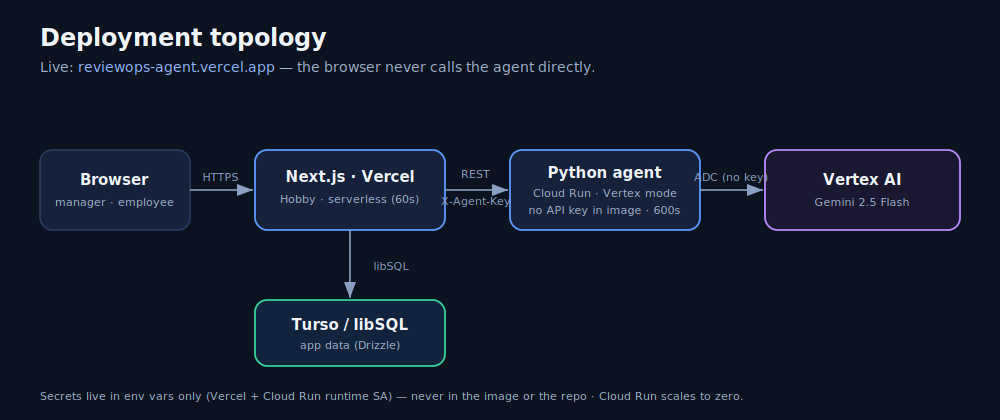

# Diagrams

Polished, self-contained SVGs (dark theme, match the live app) for the README,
the Kaggle writeup, and video slides. They render on GitHub and export cleanly to
PNG. The maintainable, source-of-truth Mermaid versions live in
[../ARCHITECTURE.md](../ARCHITECTURE.md).

## System architecture
The one-slide thesis: **access control, consent and PII minimization run in the
TypeScript app _before_ any model call** — the LLM is never the authorization
boundary.

## The three ADK 2.0 agent workflows
Questionnaire (plan → verdict-only safety → deterministic expand), Evidence
(PII node → validator → confidence-gated routing), Review (privacy → draft →
fairness/grounding).

## Deployment topology
Browser → Next.js on Vercel → stateless Python agent on Cloud Run (Vertex mode,
no key in image) → Gemini; Vercel ↔ Turso. Secrets in env only.

