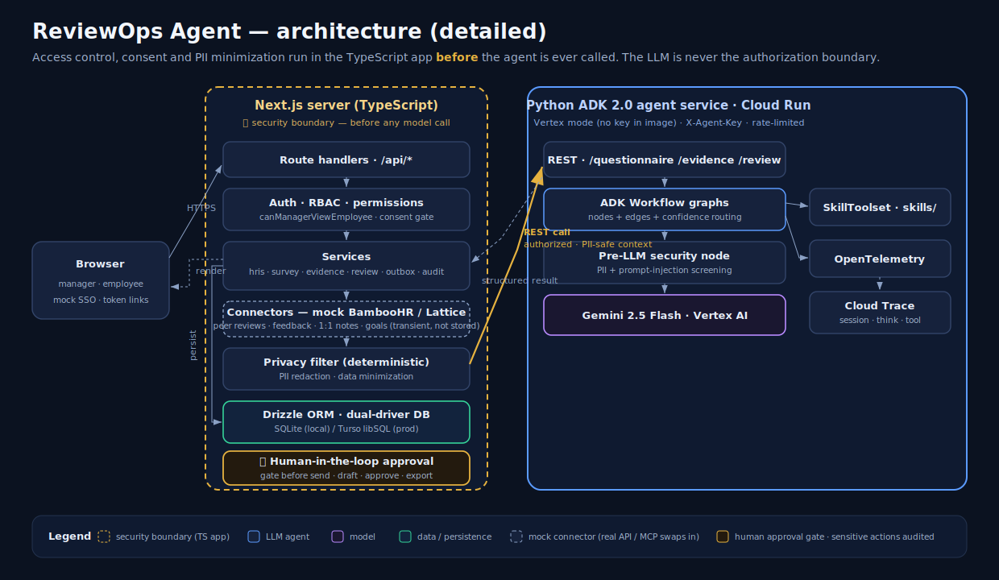

# Diagrams

Rendered SVGs used by the README and the Kaggle writeup. The editable Mermaid
sources live in [../ARCHITECTURE.md](../ARCHITECTURE.md).

## Cover image

`cover.svg` (1200×630) with a `cover.png` (2400×1260) raster export for the
Kaggle media gallery.

## System architecture

Access control, consent and PII minimization run in the TypeScript app before
any model call — the LLM is never the authorization boundary.

### Detailed view

Adds every tier's inner nodes: route handlers → auth/RBAC → services → mock
BambooHR/Lattice connectors → privacy filter → dual-driver DB, the
human-in-the-loop approval gate, and on the Python side the workflow graphs,
pre-LLM security node, Gemini, SkillToolset, and OpenTelemetry → Cloud Trace.

## The three ADK agent workflows

Questionnaire (plan → verdict-only safety → deterministic expand), Evidence
(PII node → validator → confidence-gated routing), Review (privacy → draft →
fairness/grounding).

## Deployment topology

Browser → Next.js on Vercel → stateless Python agent on Cloud Run (Vertex
mode, no key in the image) → Gemini; Vercel ↔ Turso. Secrets in env only.

